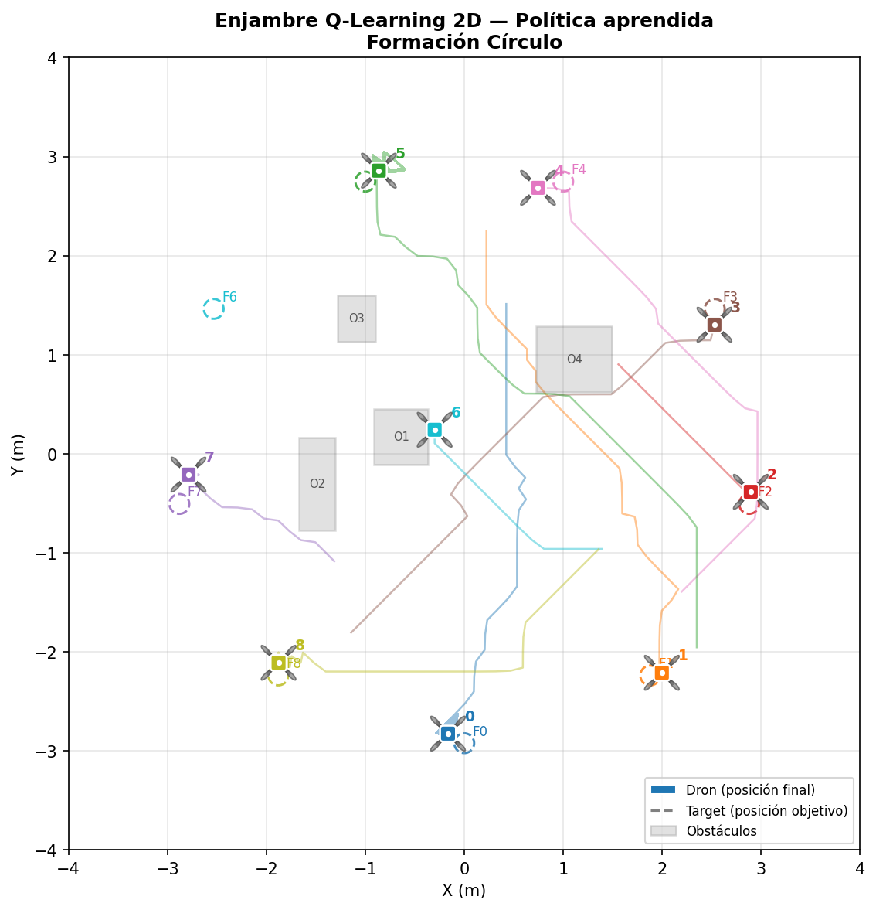
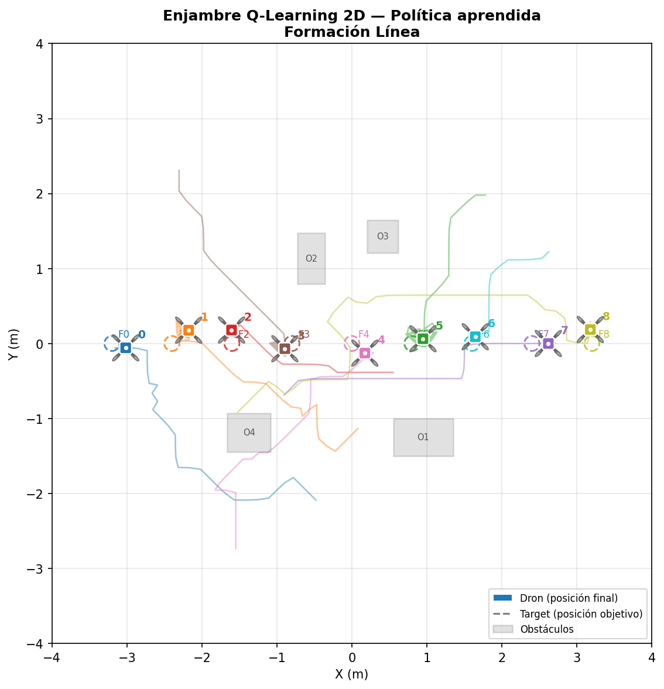
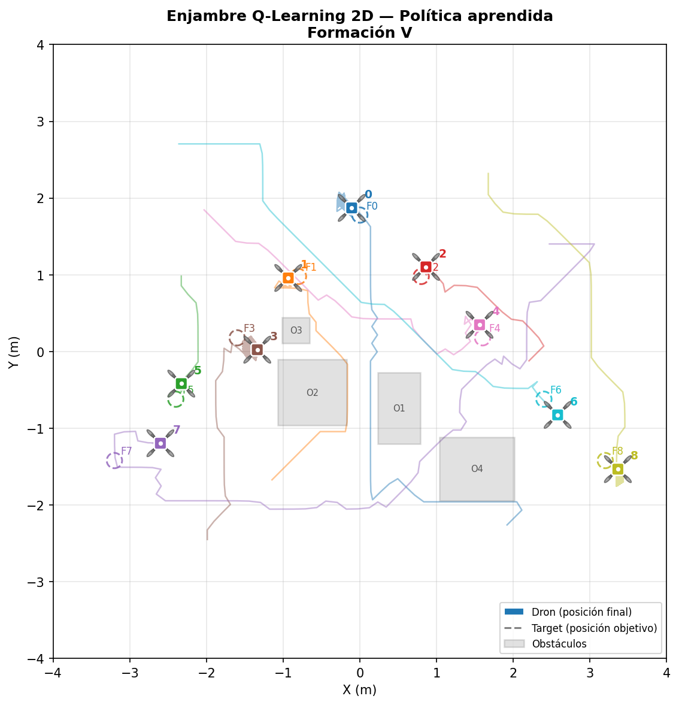
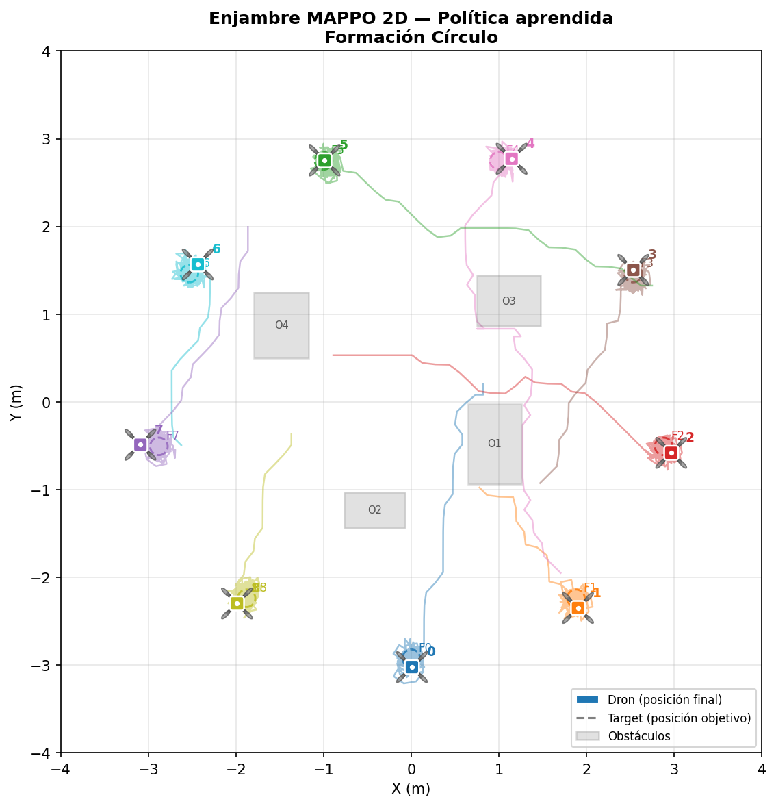
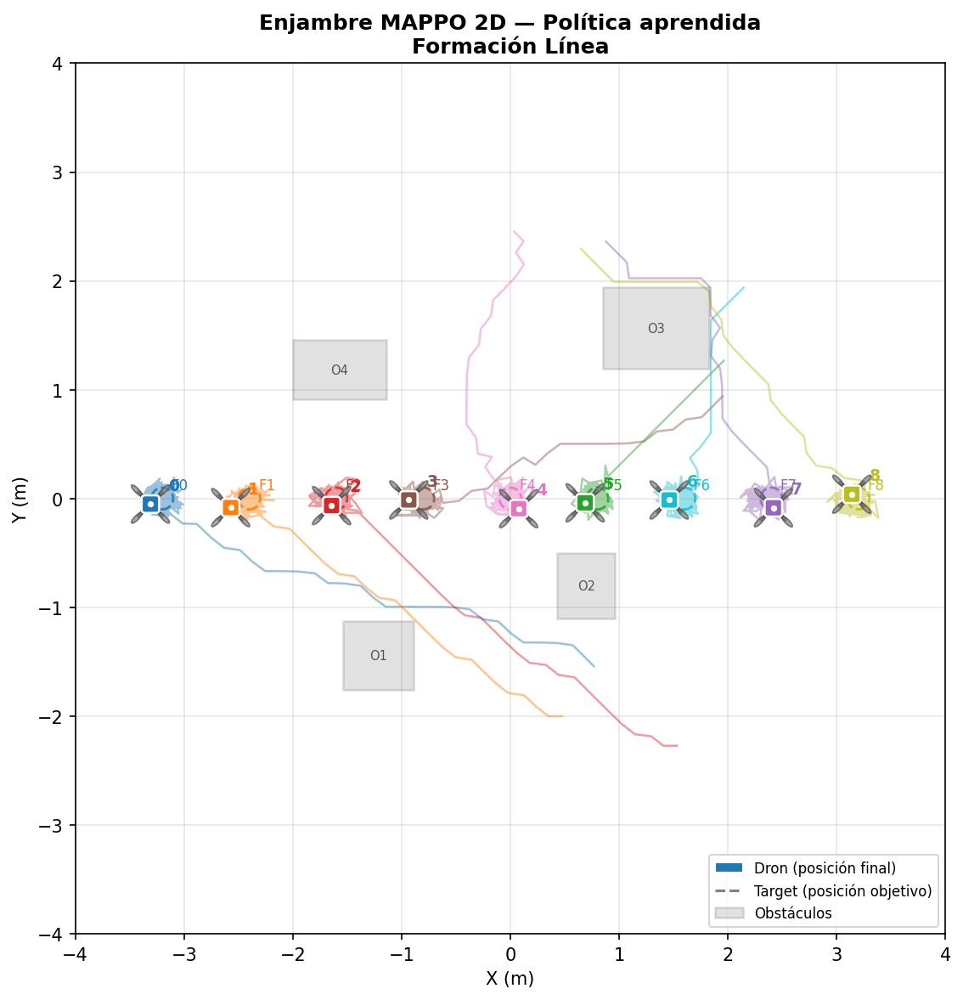
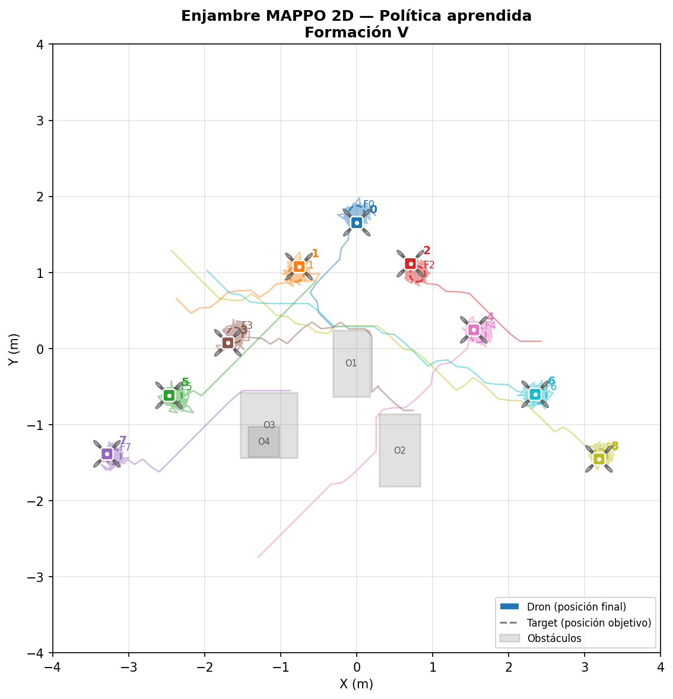

# 🚁 Simulación de Enjambre de Drones
## Q-Learning vs MAPPO para Coordinación Multi-Agente

<div align="center">


**Trabajo de Grado** | Simulación de un enjambre de 9 drones para la coordinación y formación mediante algoritmos multi-agente

</div>

---

## 📋 Descripción General

Este repositorio contiene la implementación completa de **dos algoritmos de aprendizaje por refuerzo multi-agente** aplicados al control cooperativo de un enjambre de **9 drones** en entornos 2D y 3D:

- **🎓 Q-Learning Tabular**: Política compartida con estado discretizado
- **🧠 MAPPO** (Multi-Agent Proximal Policy Optimization): Red actor-crítico centralizada

### Características Principales

✅ **12 experimentos independientes** (2 algoritmos × 3 formaciones × 2 dimensiones)  
✅ **Formaciones entrenadas**: Línea, V y Círculo  
✅ **Tracking completo** con MLflow para reproducibilidad  
✅ **Visualización 2D y 3D** de trayectorias  
✅ **Logs detallados** de entrenamiento y rendimiento  

---

## 📁 Estructura del Repositorio

```
simulador_obstaculos_final/
│
├── 📜 ejecutar_todo.py              # Orquestador principal
│
├── 📂 ql/                           # Q-Learning 2D
│   ├── config.py
│   ├── entorno_enjambre_2d.py
│   ├── agente_qlearning_2d.py
│   ├── entrenar_enjambre.py
│   └── evidencias/
│
├── 📂 ql3d/                         # Q-Learning 3D
│   ├── config3d.py
│   ├── entorno_enjambre_3d.py
│   ├── agente_qlearning_3d.py
│   ├── entrenar_enjambre_3d.py
│   └── evidencias/
│
├── 📂 mappo/                        # MAPPO 2D
│   ├── config_mappo.py
│   ├── entorno_enjambre_mappo.py
│   ├── agente_mappo.py
│   ├── entrenar_mappo.py
│   └── evidencias/
│
├── 📂 mappo3d/                      # MAPPO 3D
│   ├── config_mappo3d.py
│   ├── entorno_enjambre_mappo3d.py
|   ├── agente_mappo3d.py
│   ├── entrenar_mappo_3d.py
│   └── evidencias/
│
├── 📂 mlruns/                       # Experimentos MLflow
└── 📂 logs/                         # Logs de entrenamiento
```

---

## 🔧 Instalación Detallada

### Requisitos Previos

- **Sistema Operativo**: Windows, macOS o Linux
- **Python**: 3.10 o superior
- **Intérprete Recomendado**: Visual Studio Code

### Paso 1: Clonar el Repositorio

```bash
git clone https://github.com/CristianCative/Tesis---Enjambre-de-drones.git
cd Tesis---Enjambre-de-drones
```

### Paso 2: Configurar Visual Studio Code

1. **Instalar la extensión Python**
   - Abre VS Code
   - Ir a: `Extensions` (Ctrl+Shift+X)
   - Buscar e instalar: **Python** (Microsoft)

2. **Seleccionar intérprete Python**
   - Abre la paleta de comandos: `Ctrl+Shift+P`
   - Escribe: `Python: Select Interpreter`
   - Elige tu versión de Python 3.10+

### Paso 3: Crear Entorno Virtual

**En VS Code - Terminal integrada (Ctrl+`)**

#### Windows:
```bash
python -m venv venv
venv\Scripts\activate
```

#### macOS/Linux:
```bash
python3 -m venv venv
source venv/bin/activate
```

### Paso 4: Instalar Dependencias

```bash
# Actualizar pip
pip install --upgrade pip

# Instalar dependencias principales
pip install numpy==1.26.0
pip install torch==2.1.0
pip install matplotlib==3.8.0
pip install mlflow==2.8.0

```

### Dependencias Detalladas

| Paquete | Versión | Propósito |
|---------|---------|----------|
| **numpy** | 1.26.0+ | Cálculos numéricos y operaciones matriciales |
| **torch** | 2.1.0+ | Framework de deep learning (MAPPO) |
| **matplotlib** | 3.8.0+ | Visualización de trayectorias 2D/3D |
| **mlflow** | 2.8.0+ | Tracking de experimentos y métricas |

---

## 🚀 Uso

### Ejecutar Todos los Experimentos

Para entrenar todos los 12 modelos (Q-Learning 2D/3D + MAPPO 2D/3D en 3 formaciones):

```bash
python ejecutar_todo.py
```

⏱️ **Tiempo estimado**: 2-4 horas (dependiendo del hardware)

### Ejecutar Experimentos Individuales

#### Q-Learning 2D
```bash
cd ql
python entrenar_enjambre.py
```

#### Q-Learning 3D
```bash
cd ql3d
python entrenar_enjambre_3d.py
```

#### MAPPO 2D
```bash
cd mappo
python entrenar_mappo.py
```

#### MAPPO 3D
```bash
cd mappo3d
python entrenar_mappo_3d.py
```

### Visualizar Resultados en MLflow

```bash
mlflow ui --backend-store-uri ./mlruns --port 5000
```

Luego abre en tu navegador: **http://localhost:5000**

**En MLflow puedes:**
- 📊 Comparar métricas entre algoritmos
- 📈 Ver gráficos de convergencia
- 💾 Descargar parámetros y modelos entrenados
- 📝 Revisar hiperparámetros usados

---

## 📊 Resultados
### Visualizaciones 2D Q-Learning
- **Visualización Círculo**  
  
- **Visualización Línea**  
  
- **Visualización V**  
  

### Visualizaciones 2D MAPPO
- **Visualización Círculo**  
  
- **Visualización Línea**  
  
- **Visualización V**  
  

### Visualizaciones 3D Interactivas Q-Learning
- **Visualización Círculo**  
  [Ver aquí](https://raw.githubusercontent.com/CristianCative/Tesis---Enjambre-de-drones/main/simulador_obstaculos_final_github/RESULTADOS/Entorno_3D/Q_LEARNING/visualizacion_ql3d_circulo_20260315_205543.html)
- **Visualización Línea**  
  [Ver aquí](https://raw.githubusercontent.com/CristianCative/Tesis---Enjambre-de-drones/main/simulador_obstaculos_final_github/RESULTADOS/Entorno_3D/Q_LEARNING/visualizacion_ql3d_linea_20260315_205543.html)
- **Visualización V**  
  [Ver aquí](https://raw.githubusercontent.com/CristianCative/Tesis---Enjambre-de-drones/main/simulador_obstaculos_final_github/RESULTADOS/Entorno_3D/Q_LEARNING/visualizacion_ql3d_v_20260315_205543.html)

### Visualizaciones 3D Interactivas MAPPO
- **Visualización Círculo**  
  [Ver aquí](https://raw.githubusercontent.com/CristianCative/Tesis---Enjambre-de-drones/main/simulador_obstaculos_final_github/RESULTADOS/Entorno_3D/MAPPO/visualizacion_mappo3d_circulo_20260316_002018.html)
- **Visualización Línea**  
  [Ver aquí](https://raw.githubusercontent.com/CristianCative/Tesis---Enjambre-de-drones/main/simulador_obstaculos_final_github/RESULTADOS/Entorno_3D/MAPPO/visualizacion_mappo3d_linea_20260316_002018.html)
- **Visualización V**  
  [Ver aquí](https://raw.githubusercontent.com/CristianCative/Tesis---Enjambre-de-drones/main/simulador_obstaculos_final_github/RESULTADOS/Entorno_3D/MAPPO/visualizacion_mappo3d_v_20260316_002018.html)


### Análisis por Formación
- **Q-Learning:**  
  El algoritmo Q-Learning mostró limitaciones significativas en formaciones circulares donde los obstáculos estaban densamente distribuidos. Sin embargo, en las demas formaciones, su rendimiento varió según las condiciones iniciales.

- **MAPPO:**  
  El rendimiento fue consistentemente superior en diferentes formaciones, particularmente en escenarios con múltiples agentes que requieren navegación colaborativa.

### Conclusiones Generales
Ambos algoritmos demostraron efectividad en la navegación del entorno 2D, siendo MAPPO superior a Q-Learning en escenarios más complejos. Las visualizaciones proporcionadas ilustran las diferencias clave en su enfoque y resultados.

---

## 🎓 Información del Trabajo

**Autor**: Cristian Cative  
**Institución**: Grupo de Investigación GED — Robótica y Sistemas Autónomos  
**Año**: 2026  
**Tema**: Coordinación y formación de enjambres mediante aprendizaje por refuerzo multi-agente

### Algoritmos Comparados

#### Q-Learning Tabular
- Enfoque discreto y determinista
- Tabla Q compartida entre agentes
- Bajo costo computacional
- Escalabilidad limitada

#### MAPPO
- Enfoque continuo basado en política
- Red actor-crítico centralizada
- Mayor capacidad de generalización
- Mayor costo computacional

---

## 📝 Licencia y Uso Académico

> ⚠️ **Aviso Importante de Citación**
>
> Este repositorio es de **libre acceso** con fines **académicos, educativos y de investigación**.
>
> Si utilizas este código, total o parcialmente, en un trabajo propio —incluso con modificaciones— **debes citarlo de la siguiente forma**:
>
> ```bibtex
> @mastersthesis{Cative2026,
>   author    = {Cristian Cative},
>   title     = {Simulación de un enjambre de drones para la coordinación y formación mediante algoritmos multi-agente},
>   school    = {Grupo de Investigación GED, Colombia},
>   year      = {2026}
> }
> ```
>
> **Cativa, C. (2026).** *Simulación de un enjambre de drones para la coordinación y formación mediante algoritmos multi-agente* [Trabajo de Grado]. Grupo de Investigación GED, Colombia.
>
> ❌ **El uso comercial sin autorización expresa del autor no está permitido.**

---

## 🙏 Agradecimientos

- Grupo de Investigación GED — Robótica y Sistemas Autónomos
- Comunidad de Python y Deep Learning

---

<div align="center">

**⭐ Si este proyecto te fue útil, considera darle una estrella ⭐**

Hecho con ❤️ por Cristian Cative

</div>
